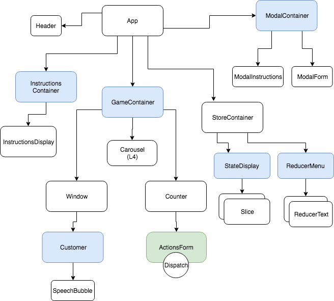

# _Redux Kitchen_

#### _A browser game to teach Redux flow and best practices._

#### By _**Aurora Shido-Wagenet, Kim McConnell, Ward Chamberlain, Randee Layosa**_

## Description

_This application is meant as a learning tool for those new to Redux, to give an overall conceptual understanding of the Redux flow between actions, reducers, and the store._

## Component Tree



## State Shapes

#### User State

_Level 1-3_

````Javascript
state = {
  Kitchen: {
    waffles: 1,
    strawberryWaffles: 2,
    biscuits: 2
  }
}
````
_Level 4+_

````Javascript
state = {
  Kitchen: {
    waffles: 1,
    strawberryWaffles: 2,
    biscuits: 2
  },
  Pantry: {
    batter: 5,
    strawberries: 7
  }
}
````

#### App State

````Javascript
state = {
  userState: {
    Kitchen: {
      waffles: 1,
      strawberryWaffles: 2,
      biscuits: 2
    },
    Pantry: {
      batter: 5,
      strawberries: 7
    }
  },
  userLevel: 1,
  dayTime: true,
  customerCount: 1
}
````

## Notes

<!-- ### Unforseen Issues
_Webpack configuring took longer than expected; getting everything working perfectly in that might be a longer process than coding any individual feature_
_PropTypes aren't working; the props themselves are but I'm not sure why the PropTypes woudln't be._
_Styling between components can be tricky. Sometimes I needed to set the width in the parent component instead._

## Setup/Installation Requirements

* _Use your command terminal (gitbash if you're using a windows machine) to clone the latest commit from Github, using the url provided_
* _Open with a text editor such as Atom to view the code_
* _In your terminal run the command "npm install"_
* _Then, run the command "npm run start" to view_

## Known Bugs

_Kegs can be drained past 0_

## Support and contact details

_If you encounter any bugs or issues not documented during your experience, please feel free to contact me at my email: fullmetalwoman@gmail.com_

## Technologies used

_This application was created using React with JSX_

### License

Copyright (c) 2019 **_ Aurora Shido-Wagenet_**

Permission is hereby granted, free of charge, to any person obtaining a copy
of this software and associated documentation files (the "Software"), to deal
in the Software without restriction, including without limitation the rights
to use, copy, modify, merge, publish, distribute, sublicense, and/or sell
copies of the Software, and to permit persons to whom the Software is
furnished to do so, subject to the following conditions:

The above copyright notice and this permission notice shall be included in all
copies or substantial portions of the Software.

THE SOFTWARE IS PROVIDED "AS IS", WITHOUT WARRANTY OF ANY KIND, EXPRESS OR
IMPLIED, INCLUDING BUT NOT LIMITED TO THE WARRANTIES OF MERCHANTABILITY,
FITNESS FOR A PARTICULAR PURPOSE AND NONINFRINGEMENT. IN NO EVENT SHALL THE
AUTHORS OR COPYRIGHT HOLDERS BE LIABLE FOR ANY CLAIM, DAMAGES OR OTHER
LIABILITY, WHETHER IN AN ACTION OF CONTRACT, TORT OR OTHERWISE, ARISING FROM,
OUT OF OR IN CONNECTION WITH THE SOFTWARE OR THE USE OR OTHER DEALINGS IN THE
SOFTWARE. -->
