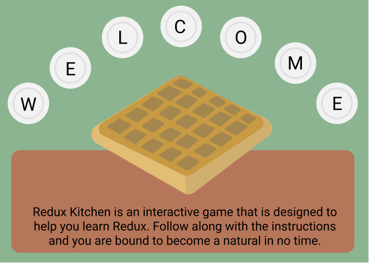
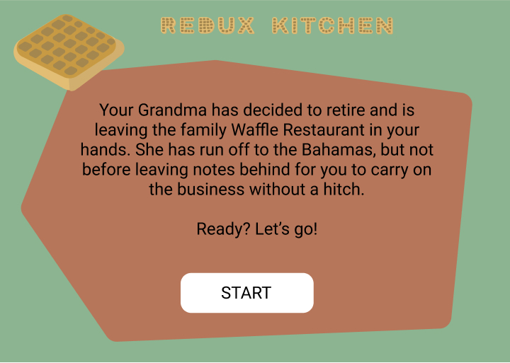
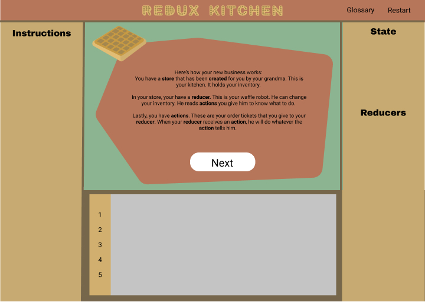
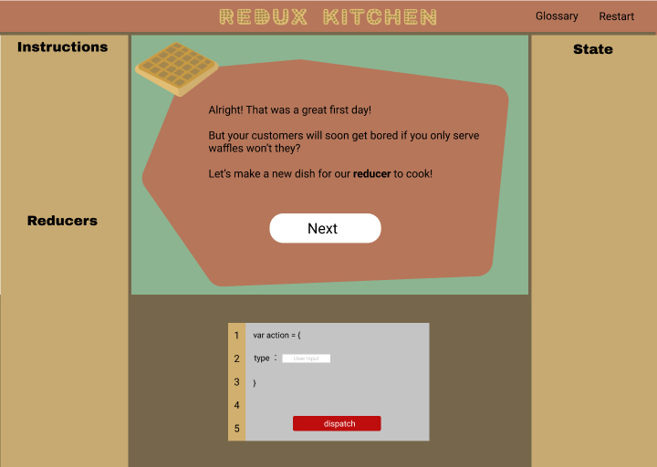
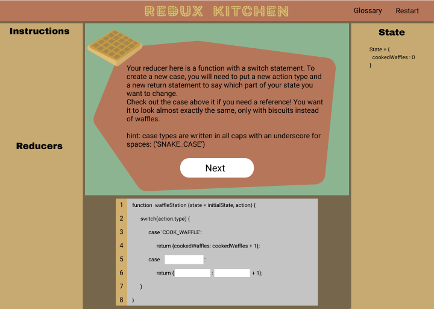

<p align='center'>

</p>

# _Redux Kitchen_

#### _A browser game to teach Redux flow and best practices._

#### By _**Aurora Shido-Wagenet, Kim McConnell, Ward Chamberlain, Randee Layosa, Tracy Reith**_

1. [Description](#description)
1. [Stretch Goals](#stretch-goals)
1. [Target Audience](#target-audience)
1. [Component Tree](#component-tree)
1. [State Shapes](#state-shapes)
1. [Installation](#setup-and-installation-requirements)
1. [Design and Development Technologies](#design-and-development-technologies)
1. [License](#license)

## Description

**Redux Kitchen** is an educational game that teaches the basic concepts of Redux: actions, reducers, the store, and how data flows in Redux.

Learners begin the game by taking over the day-to-day operation of a waffle shop. For each day's activities, they will learn to write Redux code as they complete each level.

#### Introduction
Inherit store

<p align='center'>


</p>

#### Level 1
**Day Start:** Dispatch one type of Action; Reducers: Cook Reducer
<p align='center'>

</p>

**Day End:** Add Switch Case for biscuits
<p align='center'>

</p>

#### Level 2
**Day Start:** Goal: Dispatch multiple types of actions; Reducer: Cooked Reducer 2.0
<p align='center'>

</p>

**Day End:** Goal: Modify Reducer to accept quantity payload
<p align='center'>

</p>

#### Level 3
**Day Start:** Goal: Dispatch actions with payload; Reducer: Cooked Reducer 3.0

**Day End:** Goal: Add pantry and kitchen reducers, buy ticket wheel

## Stretch Goals
#### Level 4: Day start
Goal: Dispatch actions to both reducers at once

## Target Audience
Developers and students new to Redux. Prerequisites:
Javascript, React (optional).

## Component Tree


## State Shapes

#### User State

_Level 1-3_

````Javascript
state = {
  Kitchen: {
    waffles: 1,
    strawberryWaffles: 2,
    biscuits: 2
  }
}
````
_Level 4+_

````Javascript
state = {
  Kitchen: {
    waffles: 1,
    strawberryWaffles: 2,
    biscuits: 2
  },
  Pantry: {
    batter: 5,
    strawberries: 7
  }
}
````

#### App State

````Javascript
state = {
  userState: {
    Kitchen: {
      waffles: 1,
      strawberryWaffles: 2,
      biscuits: 2
    },
    Pantry: {
      batter: 5,
      strawberries: 7
    }
  },
  userLevel: 1,
  dayTime: true,
  customerCount: 1
}
````

## Setup and Installation Requirements

* Use your command terminal (gitbash if you're using a windows machine) to clone the latest commit from Github, using the url provided
* Open with a text editor such as Atom to view the code
* In your terminal run the command `npm install`
* Then, run the command `npm run start` to view

<!--
## Known Bugs

_Kegs can be drained past 0_

## Support and contact details

_If you encounter any bugs or issues not documented during your experience, please feel free to contact me at my email: fullmetalwoman@gmail.com_
-->

## Design and Development Technologies
* Javascript
* React-Redux
* HTML5 and CSS3
* Figma


### License
[MIT](./LICENSE.txt)  

Copyright (c) 2019 Aurora Shido-Wagenet, Kim McConnell, Ward Chamberlain, Randee Layosa, Tracy Reith
